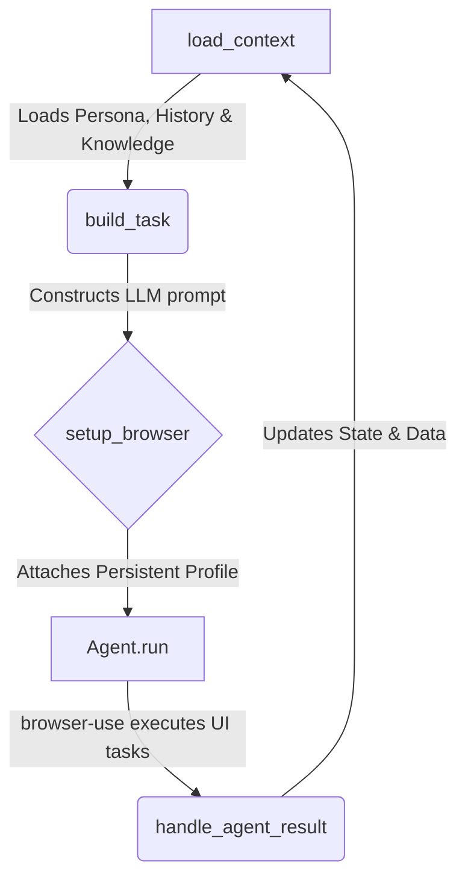

# 🤖 Social Agent

[](https://www.python.org/downloads/)
[](https://opensource.org/licenses/MIT)
[](https://streamlit.io)

AI-powered social media automation for X (Twitter), LinkedIn, and WhatsApp using [browser-use](https://github.com/browser-use/browser-use) + Google Gemini. 

The agent manages your social media presence by browsing the actual platforms in a real Chrome browser—posting, replying, engaging with feeds, and running on a schedule—all while maintaining your authentic voice and persona.

---

## ⚡ Core Capabilities

- **X (Twitter) Automation:** Seamlessly scrape feeds, publish posts, reply to threads, run active engagement sessions, conduct product marketing, and handle custom research tasks.
- **LinkedIn Growth:** Scrape your profile, publish thought-leadership posts, actively comment on peers' updates, and maintain engagement sessions.
- **WhatsApp Integration:** Automate responses to specific contacts or custom lists directly via QR code web login.
- **Autonomous Schedulers:** Run X and LinkedIn active modes on randomized intervals to simulate natural, human-like activity patterns.
- **Research Engine:** Generate domain-specific knowledge bases using Gemini + Google Search, injected directly into the agent's context.
- **Visual Command Center:** A sleek Streamlit dashboard to manage API keys, persona settings, schedules, and trigger one-off tasks with zero CLI knowledge needed.

---

## 🛠️ Prerequisites

- **Python 3.11+**
- **Google Chrome** installed locally
- **Google Gemini API Key** (Get one at [Google AI Studio](https://aistudio.google.com/app/apikey))
- **[uv](https://github.com/astral-sh/uv)** installed for lightning-fast dependency management

---

## 🚀 Quick Start

### 1. Clone & Install Dependencies
```bash
git clone https://github.com/bravian1/social-agent.git
cd social-agent
uv sync
```

### 2. Launch the Dashboard
```bash
uv run streamlit run app.py
```
*Tip: If anything is unconfigured, the dashboard will display a banner telling you exactly what is missing.*

### 3. Configure Your Agent (Dashboard Settings)
Head over to the **Settings** tab in the dashboard to:
1. Paste your `GOOGLE_API_KEY` (automatically stored securely in `.env`).
2. Define your persona, content strategies, and queue.
3. Run **Scrape feed** and **Scrape replies** to provide the agent with style references.
4. Run **Update research** to fetch the latest industry insights for your agent's knowledge base.

### 4. Initial Platform Login
To allow the agent to work on your behalf, log in to each platform once. Run this in the dashboard or via CLI:
```bash
uv run python -m agents.x login
uv run python -m agents.linkedin login
```
A Chrome window will open. Simply log in to your account normally. Your session cookies will be safely stored and reused for autonomous runs.

---

## ⌨️ Usage Guide

### Visual Dashboard (Recommended)
`uv run streamlit run app.py` is the easiest way to interact with Social Agent. 
- **Platform Tabs:** Manage X, LinkedIn, or WhatsApp independently.
- **Scheduler Control:** Start / stop randomized schedules and monitor logs.
- **Settings:** Keep API keys, persona definitions, and research data up to date.

### Command Line Interface (CLI)
You can invoke the individual platform agents directly via your terminal.

**X (Twitter)**
```bash
uv run python -m agents.x active --theme "AI and software"       # Browse and engage naturally
uv run python -m agents.x post --theme "developer tools"         # Post a relevant tweet
uv run python -m agents.x reply --url <tweet_url> --theme "AI"   # Reply to a specific thread
uv run python -m agents.x scrape --count 15                      # Extract recent feed tweets
uv run python -m agents.x research --domain "AI and Software"    # Build your context knowledge
uv run python -m agents.x market --product "My SaaS feature"     # Market a specific product
uv run python -m agents.x custom --custom-prompt "Write a joke"  # Custom one-off prompt
```

**LinkedIn**
```bash
uv run python -m agents.linkedin active --theme "software architecture"
uv run python -m agents.linkedin post --theme "The future of AI agents"
uv run python -m agents.linkedin comment --url <post_url> --theme "SaaS"
```

**WhatsApp**
```bash
uv run python -m agents.whatsapp --login                         # Scan QR code and authenticate
uv run python -m agents.whatsapp --auto-person --name "John"     # Auto-respond to specific contact
uv run python -m agents.whatsapp --auto-unread                   # Sweep and reply to all unread messages
uv run python -m agents.whatsapp --auto-unread --filter "Fam"    # Sweep specific contact lists/folders
```

**Autonomous Schedulers**
```bash
uv run python -m schedulers.x_scheduler --theme "tech" --interval-min 60 --interval-max 120
uv run python -m schedulers.linkedin_scheduler --theme "software development"
```

### The `user_requests.txt` Workflow
If you want granular control over what gets posted without hard-scheduling exact times, simply add ideas as new lines in `data/user_requests.txt`:
```text
Just shipped a feature that cuts API response time by 60% — here's how
Hot take: most "AI wrappers" aren't solving the right problems
```
During an **active** session, the agent will pick off one line, draft an authentic post reflecting your persona, publish it, and remove it from the queue. 

---

## 📂 Configuration & Data Reference

All user data, logs, and generated content are neatly organized in the `data/` directory.

| File | Purpose | Generated By |
|------|---------|------------|
| `user_profile.txt` | Core persona, tone instructions, and beliefs | Settings Dashboard |
| `user_requests.txt` | Content queue lines (processed iteratively) | Settings Dashboard |
| `data.txt` | Synthesized domain knowledge base | `research` mode |
| `tweets.json` | Reference style mimicking for X | X `scrape` mode |
| `comments.json` | Reference style for X replies | X `scrape` mode |
| `active_history.json` | X sessions history protecting against duplicate interactions | X `active` mode |
| `linkedin_history.json` | LinkedIn sessions history | LinkedIn `active` mode |
| `virality_notes.txt` | Engagement patterns observed on X | X `active` mode |
| `growth_log.json` | Follower count timeline | X `active` mode |
| `linkedin_profile.txt` | Cached professional summary | LinkedIn `scrape` mode |
| `post_strategy.txt` | LinkedIn growth strategy rules | Settings Dashboard |

---

## 🧩 Architecture

Social Agent maps a consistent workflow loop for autonomous browsing across all supported platforms. 



*Note: The `scheduler` implementations wrap the core `active` loop in a randomized sleep cycle (e.g. between 60 to 120 minutes) to closely mimic human presence and avoid platform limit flags.*

---

## 🤝 Contributing

We welcome contributions! Please refer to our [CONTRIBUTING.md](CONTRIBUTING.md) guide to learn how you can submit PRs, add platform capabilities, or refine our browser instructions.

---

## 📄 License

This project is licensed under the MIT License — see the [LICENSE](LICENSE) file for details.
